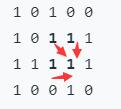
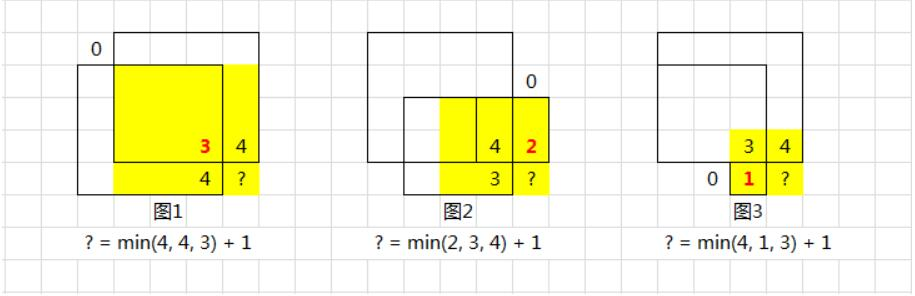

# 221. 最大正方形
## 暴力法

1. 依次遍历，为1则可作为正方形左上角
2. 可能的最大边长为Math.floor(rows - i, cols - j)
3. 依次判断对角线上点是否为1，是的话判断两边是否都为1

## 动态规划
> [图片来源](https://leetcode-cn.com/problems/maximal-square/solution/li-jie-san-zhe-qu-zui-xiao-1-by-lzhlyle/)

