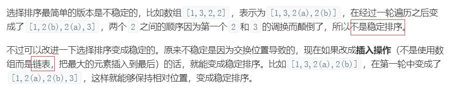

# 排序

## 冒泡排序
1. i从0到(length - 1)
2. exchange记录是否有交换，用于优化
3. j从0到(length - i)
- 每次比较i和(i + 1)，判断是否需要交换
4. 内部循环结束，通过exchange判断是否已排序，排好则退出

## 选择排序
1. i从0到(length - 1)
2. minIndex记录最小数位置
3. j从i + 1到(length - 1)
- 每次找出未排好序中的最小数位置
4. 判断最小数位置是否为i，不是则需要交换

选择排序是不稳定的：(7) 2 5 9 3 4 [7] 1

## 插入排序
1. i从0到(length - 1)
2. j从i到0
- 寻找j应该处于已排序序列中的位置：每次比较j和(j - 1)，直到(j - 1)位置数 < j位置数退出

## 归并排序(分治法)
1. 递归，拆分数组
2. 对左右子数组排序合并，回溯

## 快速排序
1. 定基点pivot(左侧/右侧)
2. 定左侧：i从1开始，j从right开始，开始确定基点应该在的位置
3. 判断i位置数是否大于基点数，大于则与j位置数交换(放到右侧)，该数已确定j--；否则i++
4. i === j 退出循环,一轮下来确定好了基点应该在的位置，同时分好了大于基点和小于基点两部分
- i未移动且nums[i] < nums[pivot]交换，nums[i] >= nums[pivot]自身交换(i - 1)
- i移动了此时i位于第一个大于nums[pivot]的数所在位置，应该和i-1位置数交换
5. 递归排序小于基点部分和大于基点部分(不需要包含基点了)

## 堆排序
1. 构建初始堆(大根堆)
- 从第一个非叶子节点`Math.floor(arr.length / 2 - 1)`开始，往上构建
- 找出当前节点的左右子节点中最大的那项`temp`，左节点为`2 * i + 1`
- 判断`temp`那项是否大于当前节点`i`，大于则需交换(大的往上走)；否则无需交换且以子节点为根节点的符合堆，直接退出循环
- 在交换后，可能会影响以子节点为根节点的堆，需要对子节点堆调整，当前节点`i`变为交换的子节点`temp`，`j`还是表示`i`的左子节点`2 * i + 1`